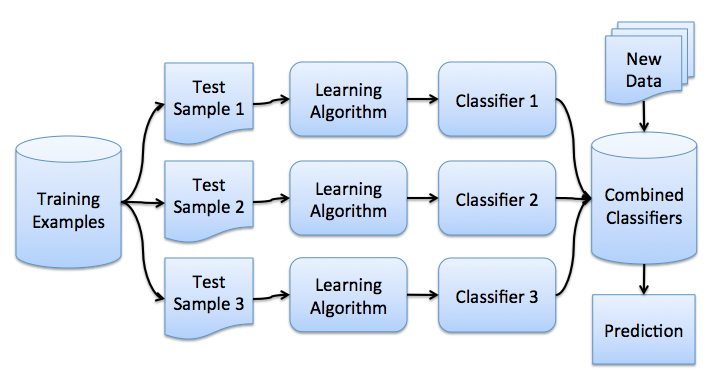

#### НЕДЕЛЯ 5 
#### Композиции алгоритмов

Ансамблем называется система, состоящая из некоторого количества алгоритмов машинного обучения.
Хорошим примером ансамблей считается теорема Кондорсе «о жюри присяжных» (1784). Если каждый член жюри присяжных имеет 
независимое мнение, и если вероятность правильного решения члена жюри больше 0.5, то тогда вероятность правильного решения 
присяжных в целом возрастает с увеличением количества членов жюри и стремится к единице. Если же вероятность быть правым у 
каждого из членов жюри меньше 0.5, то вероятность принятия правильного решения присяжными в целом монотонно уменьшается и 
стремится к нулю с увеличением количества присяжных.

Бутстрэп
Bagging (от Bootstrap aggregation) — это один из первых и самых простых видов ансамблей. Он был придуман Ле́о Бре́йманом в 1994 году.
Бэггинг основан на статистическом методе бутстрэпа, который позволяет оценивать многие статистики сложных распределений.

Метод бутстрэпа заключается в следующем. Пусть имеется выборка X размера N. Равномерно возьмем из выборки N объектов с возвращением.
Это означает, что мы будем N раз выбирать произвольный объект выборки (считаем, что каждый объект «достается» с одинаковой 
вероятностью ), причем каждый раз мы выбираем из всех исходных N объектов. Можно представить себе мешок, из которого достают 
шарики: выбранный на каком-то шаге шарик возвращается обратно в мешок, и следующий выбор опять делается равновероятно из 
того же числа шариков. Отметим, что из-за возвращения среди них окажутся повторы. Обозначим новую выборку через X1. 
Повторяя процедуру M раз, сгенерируем M подвыборок . Теперь мы имеем достаточно большое число выборок и можем оценивать 
различные статистики исходного распределения.

##### Бэггинг
Теперь вы имеете представление о бустрэпе, и мы можем перейти непосредственно к бэггингу. Пусть имеется обучающая выборка X. 
С помощью бутстрэпа сгенерируем из неё выборки X...Xm. Теперь на каждой выборке обучим свой классификатор ai. 
Итоговый классификатор будет усреднять ответы всех этих алгоритмов (в случае классификации это соответствует голосованию) 
Эту схему можно представить картинкой ниже.

Бэггинг позволяет снизить дисперсию (variance) обучаемого классификатора, уменьшая величину, на сколько ошибка будет отличаться, 
если обучать модель на разных наборах данных, или другими словами, предотвращает переобучение. Эффективность бэггинга достигается 
благодаря тому, что базовые алгоритмы, обученные по различным подвыборкам, получаются достаточно различными, и их ошибки взаимно 
компенсируются при голосовании, а также за счёт того, что объекты-выбросы могут не попадать в некоторые обучающие подвыборки.

Бэггинг эффективен на малых выборках, когда исключение даже малой части обучающих объектов приводит к построению существенно 
различных базовых классификаторов. В случае больших выборок обычно генерируют подвыборки существенно меньшей длины.

##### Случайный лес
Random forest (случайный лес) — алгоритм машинного обучения, предложенный Лео Брейманом и Адель Катлер, заключающийся в 
использовании комитета (ансамбля) решающих деревьев. Алгоритм сочетает в себе две основные идеи: метод `бэггинга`, 
и метод `случайных подпространств`. Алгоритм применяется для задач классификации, регрессии и кластеризации. Основная идея 
заключается в использовании большого ансамбля решающих деревьев, каждое из которых само по себе даёт очень невысокое качество 
классификации, но за счёт их большого количества результат получается хорошим. 

Чем алгоритм построения дерева в случайном лесу отличается от алгоритма ID3 ?
- [x] Для обучения используется подвыборка объектов 
- [x] Признак в каждой вершине выбирается из случайного подмножества признаков
- [ ] Производится стрижка дерева
- [ ] Ограничивается глубина дерева

Обучение случайного леса:
- Беггинг над решающими деревьями
- Усечение дерева (pruning) не производится
- Признак в каждой вершине дерева выбирается из случайного подмножества k из n признаков
- Для регресии рекомендуется использовать k = n/3
- Для классификации рекомендуется использовать k = sqrt(n)

Резюме:
- Random Forest - один из самых сильных методов машинного обучения
- Random Forest - обычно лишь немного уступает градиентному бустингу
- Бэггинг позволяет вычислять оценки out-of-bag:
    - Для оптимизации числа базовых алгоритмов Т
    - Для оценивании важности признаков
    - Для выбора параметра k в RF
- Беггинг, Random Forest - эффективно распараллеливаются

##### Градиентный бустинг

Бустинг (англ. boosting — улучшение) — это процедура последовательного построения композиции алгоритмов машинного обучения, 
когда каждый следующий алгоритм стремится компенсировать недостатки композиции всех предыдущих алгоритмов. 
Бустинг представляет собой жадный алгоритм построения композиции алгоритмов. 

В течение последних 10 лет бустинг остаётся одним из наиболее популярных методов машинного обучения, наряду с нейронными сетями 
и машинами опорных векторов. Основные причины — простота, универсальность, гибкость (возможность построения различных модификаций),
и, главное, высокая обобщающая способность.

Бустинг над решающими деревьями считается одним из наиболее эффективных методов с точки зрения качества классификации. Во многих 
экспериментах наблюдалось практически неограниченное уменьшение частоты ошибок на независимой тестовой выборке по мере 
наращивания композиции. Более того, качество на тестовой выборке часто продолжало улучшаться даже после достижения безошибочного 
распознавания всей обучающей выборки. Это перевернуло существовавшие долгое время представления о том, что для повышения 
обобщающей способности необходимо ограничивать сложность алгоритмов. На примере бустинга стало понятно, что хорошим качеством 
могут обладать сколь угодно сложные композиции, если их правильно настраивать.

Впоследствии феномен бустинга получил теоретическое обоснование. Оказалось, что взвешенное голосование не увеличивает эффективную 
сложность алгоритма, а лишь сглаживает ответы базовых алгоритмов. 

Какими свойствами должна обладать функция потерь для построения композиции с помощью градиентного бустинга
- [x] Функция потерь должна быть гладкой
- [ ] Область значений функции должна быть интервалом от 0 до 1
- [ ] На функцию потерь в данной задаче можно не накладывать ограничений
- [x] Функции потерь должны быть ограничены снизу

Резюме:
- Градиентный бустинг - наиболее общий из всех бустингов
    - произвольная функция потерь
    - произвольное пространство оценок
    - подходит для регрессии, классификации и ранжирования
- Обощающая способность бустинга не ухудщается с ростом сложности 
- Стохастический вариант градиентного бустинга лучше и быстрее
- Градиентный бустинг над решающими деревьями часто работает лучше, чем случайный лес
  

### Источники
- [https://habr.com/company/ods/blog/324402/](Открытый курс машинного обучения. Тема 5. Композиции: бэггинг, случайный лес)
- [https://habr.com/company/ods/blog/327250/](Открытый курс машинного обучения. Тема 10. Градиентный бустинг)

